# 🛒 Catálogo Multi-Cliente (MVP)

Este projeto é um **microserviço multi-cliente** que permite que cada usuário (cliente) crie uma conta, faça login e gerencie seu **catálogo de produtos**.
Os produtos podem ser importados via **upload de CSV** e ficam isolados por cliente.

---

## 🔹 Tecnologias

* **Node.js + Express** (API REST)
* **PostgreSQL** (banco de dados)
* **JWT** (autenticação)
* **Multer** (upload de arquivos)
* **csvtojson** (parse do CSV)
* (Opcional: Docker + Deploy em **Azure/AWS**)

---

## 🔹 Estrutura do Banco

```sql
-- Tabela de clientes
CREATE TABLE clientes (
    id SERIAL PRIMARY KEY,
    nome VARCHAR(100) NOT NULL,
    email VARCHAR(150) UNIQUE NOT NULL,
    senha TEXT NOT NULL
);

-- Tabela de produtos
CREATE TABLE produtos (
    id SERIAL PRIMARY KEY,
    cliente_id INT NOT NULL REFERENCES clientes(id) ON DELETE CASCADE,
    codigo VARCHAR(50),
    descricao TEXT,
    preco NUMERIC(10,2),
    grupo VARCHAR(100),
    foto TEXT
);
```

---

## 🔹 Fluxo Geral da Arquitetura

```mermaid
flowchart LR
    subgraph Cliente["👤 Cliente"]
        A1[📱 Front-end Web/App]
    end

    subgraph API["🖥️ Node.js + Express (Microserviço)"]
        B1[/🔑 /register/]
        B2[/🔑 /login/]
        B3[/📤 /upload/]
        B4[/📦 /produtos/]
    end

    subgraph Banco["🐘 PostgreSQL"]
        C1[(clientes)]
        C2[(produtos)]
    end

    A1 -- Cadastro/Login --> B1
    A1 -- Cadastro/Login --> B2
    A1 -- Upload CSV --> B3
    A1 -- Consulta Produtos --> B4

    B1 --> C1
    B2 --> C1
    B3 --> C2
    B4 --> C2

    B3 -. injeta cliente_id .-> C2
```



---

## 🔹 Fluxo de Upload de CSV

```mermaid
sequenceDiagram
    participant Cliente as 👤 Cliente (Front-end)
    participant API as 🖥️ API (Node.js/Express)
    participant DB as 🐘 Banco (PostgreSQL)

    Cliente->>API: POST /login (email, senha)
    API->>DB: SELECT cliente FROM clientes WHERE email=?
    DB-->>API: cliente encontrado
    API-->>Cliente: JWT Token

    Cliente->>API: POST /upload (CSV + JWT)
    API->>API: Valida Token (JWT)
    API->>API: Converte CSV -> JSON (csvtojson)
    loop Cada linha do CSV
        API->>DB: INSERT INTO produtos(cliente_id, codigo, descricao, preco, grupo, foto)
    end
    DB-->>API: confirma inserts
    API-->>Cliente: { success: true, message: "Produtos importados!" }
```



---

## 🔹 Fluxo de Consulta de Produtos

```mermaid
sequenceDiagram
    participant Cliente as 👤 Cliente (Front-end)
    participant API as 🖥️ API (Node.js/Express)
    participant DB as 🐘 Banco (PostgreSQL)

    Cliente->>API: GET /produtos (JWT)
    API->>API: Valida Token (JWT)
    API->>DB: SELECT * FROM produtos WHERE cliente_id=?
    DB-->>API: Lista de produtos
    API-->>Cliente: JSON [{codigo, descricao, preco, grupo, foto}, ...]
```



---

## 🔹 Exemplo de CSV esperado

```csv
codigo,descricao,preco,grupo,foto
P001,Produto Teste 1,19.90,Bebidas,https://meusite.com/img/p001.jpg
P002,Produto Teste 2,35.50,Alimentos,https://meusite.com/img/p002.jpg
```

---

## 🔹 Rotas da API

### 🔑 Cadastro

```http
POST /register
{
  "nome": "Cliente Teste",
  "email": "cliente@teste.com",
  "senha": "123456"
}
```

### 🔑 Login

```http
POST /login
{
  "email": "cliente@teste.com",
  "senha": "123456"
}
```

👉 Retorna `JWT Token`.

### 📤 Upload CSV

```http
POST /upload
Authorization: Bearer <token>
Content-Type: multipart/form-data

file: produtos.csv
```

### 📦 Listar Produtos

```http
GET /produtos
Authorization: Bearer <token>
```

---

## 🔹 Como rodar o projeto

```bash
git clone https://github.com/seu-repo/catalog_multiclient.git
cd catalog_multiclient
npm install
npm start
```

API disponível em:
👉 `http://localhost:3000`

---

🔥 Pronto! Esse README já documenta **arquitetura, fluxo, banco, API e exemplos de uso**.
Quer que eu já monte também um **docker-compose.yml** com PostgreSQL + API pra você subir rapidão no Azure/AWS?
